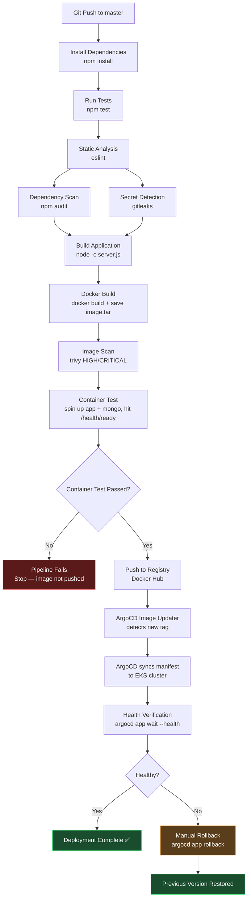

# CI/CD Pipeline Flow — employee-app

This diagram shows the full pipeline: from `git push` through build, test,
security scanning, image publishing, and GitOps-based deployment via ArgoCD.

## Stage-by-stage notes

| Stage | Tool | Blocking? |
|---|---|---|
| Install | npm | Yes |
| Test | npm test | Yes |
| Static Analysis | eslint | No (`allow_failure: true`) |
| Dependency Scan | npm audit | No (`allow_failure: true`) |
| Secret Detection | gitleaks | No (`allow_failure: true`) |
| Build | node syntax check | Yes |
| Docker Build | docker | Yes |
| Image Scan | trivy | No — *recommend changing to blocking for production* |
| Container Test | docker + health check | Yes |
| Registry Push | Docker Hub | Yes |
| Deploy | ArgoCD (GitOps, outside CI) | N/A — decoupled from CI |
| Health Verification | argocd app wait | Yes |
| Rollback | argocd app rollback | Manual trigger only |

## Why deployment is decoupled from CI

The CI pipeline's responsibility ends at pushing a scanned, tested image to
the registry. ArgoCD (with Image Updater) separately watches the registry/Git
and handles the actual cluster deployment. This avoids CI directly running
`kubectl` against the cluster, keeps deployment auditable via Git history, and
prevents drift between what's in Git and what's running.