# Employee Management Platform — Production-Ready DevOps

[](https://github.com/Maadhav3112/Employee-Devops-Thikse)
[](https://aws.amazon.com/eks/)
[](https://argo-cd.readthedocs.io/)
[](https://www.terraform.io/)
[](https://www.datadoghq.com/)

> **Build → Containerize → Compose → Secure → Deploy → Automate → Monitor → Troubleshoot → Document**

A complete production-oriented DevOps platform built around an **Employee Management** REST API (Node.js + Express + MongoDB), demonstrating a full lifecycle on controlled personal/internship resources.

**Repository:** [Maadhav3112/Employee-Devops-Thikse](https://github.com/Maadhav3112/Devops-Prod-Ready)

---

## Table of Contents

- [Overview](#overview)
- [Architecture](#architecture)
- [Tech Stack](#tech-stack)
- [Project Structure](#project-structure)
- [Application](#application)
- [Local Development (Docker Compose)](#local-development-docker-compose)
- [CI/CD Pipeline](#cicd-pipeline)
- [GitOps with Argo CD](#gitops-with-argo-cd)
- [Kubernetes (EKS)](#kubernetes-eks)
- [Infrastructure as Code (Terraform)](#infrastructure-as-code-terraform)
- [Monitoring (Datadog)](#monitoring-datadog)
- [Security](#security)
- [Rollback](#rollback)
- [Challenges & Solutions](#challenges--solutions)
- [Documentation](#documentation)
- [Getting Started](#getting-started)

---

## Overview

This project evolves a small Employee Management service into a **production-ready platform** covering:

| Area | What was implemented |
|------|----------------------|
| Application | Backend API, MongoDB, health/readiness/liveness, logging, env-based config |
| Containers | Multi-stage Dockerfile, non-root, Compose with persistent volumes |
| CI | Lint → Unit tests → Build → Docker build → Container test → Security scans |
| CD / GitOps | Argo CD continuous sync, version upgrades (v1 → v2), rollback |
| Kubernetes | EKS, Namespace, Deployment (≥2 replicas), Service, ConfigMap, Secret, probes |
| IaC | Terraform for IAM, EKS-related resources, repeatable infrastructure |
| Observability | Datadog metrics, logs, APM; Kubernetes probes; structured JSON logs |

No THIKSE production credentials or internal source were used.

---

## Architecture

```text
Developer
    ↓
Git Repository
    ↓
CI Pipeline (GitLab / GitHub Actions)
    ├── Lint / Unit Tests
    ├── Security Scan
    ├── Docker Build + Image Scan
    └── Push to Registry
          ↓
Argo CD (GitOps)
          ↓
Amazon EKS
    ├── Pod 1 (replica)
    └── Pod 2 (replica)
          ↓
Application + MongoDB
          ↓
Datadog (metrics, logs, APM)
```

---

## Tech Stack

| Layer | Technology |
|-------|------------|
| Application | Node.js, Express, MongoDB, Mongoose |
| Frontend | Static HTML/CSS/JS served by Express |
| Containers | Docker, Docker Compose |
| Orchestration | Amazon EKS |
| GitOps | Argo CD |
| CI | GitLab CI / GitHub Actions |
| IaC | Terraform |
| Monitoring | Datadog (Agent + Operator), K8s probes |
| Security | Non-root images, Secrets, image/dependency scans |

---

## Project Structure

```text
Employee-Devops-Thikse/
├── application/              # Source (Express API + public UI)
├── tests/
│   ├── unit/
│   ├── integration/
│   └── container/smoke_test.sh
├── kubernetes/              # Manifests (namespace, deployment, service, ...)
├── terraform/                # IaC
├── scripts/                  # build, test, deploy, rollback helpers
├── monitoring/               # Datadog setup, probes, alerts
│   └── datadog/
│       ├── setup.md
│       └── datadog-agent.yaml
├── docs/
│   ├── architecture/
│   ├── security/
│   ├── troubleshooting/
│   ├── deployment/
│   └── images/               # Screenshots used in this README
├── mongo-dockerfile/
├── .github/workflows/
├── Dockerfile
├── docker-compose.yml
├── .env.example
└── README.md
```

---

## Application

Employee Management REST API with a lightweight web UI.

**Features:** CRUD for employees (name, email, department, role, salary), health endpoint, MongoDB persistence, environment-based configuration.

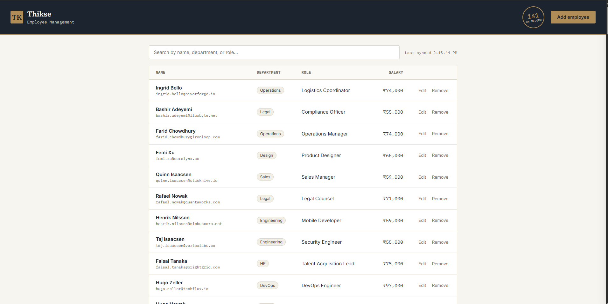

*Employee roster UI — list, search, edit, remove*

| Method | Endpoint | Description |
|--------|----------|-------------|
| GET | `/health` | Liveness / health check |
| GET | `/api/employees` | List employees |
| POST | `/api/employees` | Create employee |
| GET | `/api/employees/:id` | Get one |
| PUT | `/api/employees/:id` | Update |
| DELETE | `/api/employees/:id` | Delete |

---

## Local Development (Docker Compose)

```bash
cp .env.example .env    # set MONGO_ROOT_USER / MONGO_ROOT_PASSWORD
docker compose up --build
```

- Frontend / API: `http://localhost:9500`
- Health: `http://localhost:9500/health`
- MongoDB: `localhost:20000` (if exposed)

Data persists across restarts via Docker volumes.

---

## CI/CD Pipeline

Pipeline stages:

**Checkout → Dependencies → Lint → Unit Tests → Build → Docker Build → Container Test → Security Scan → Push**

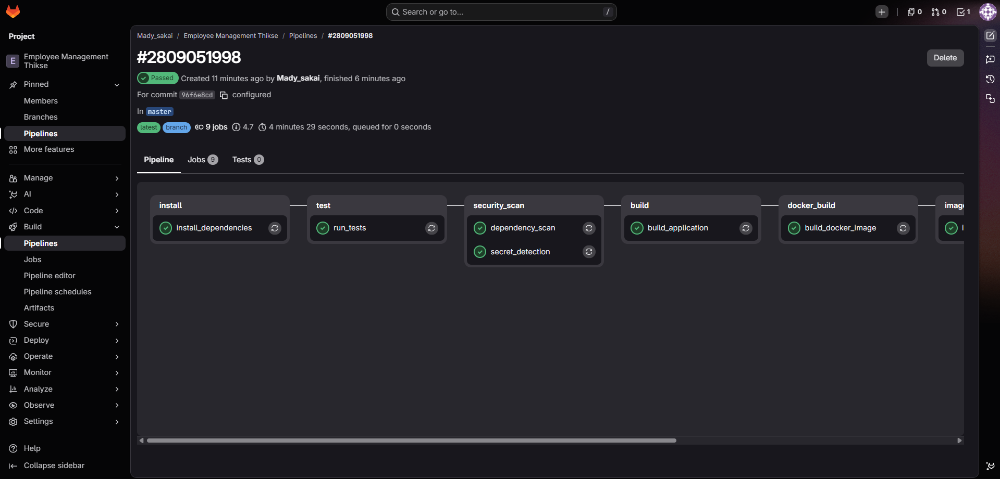

*GitLab project — Pipelines, Jobs, Deploy*

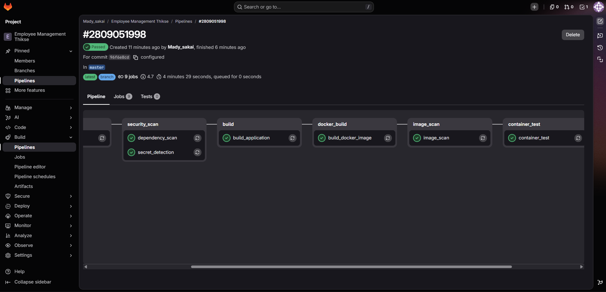

*Pipeline / jobs view*

- Unit tests live under `tests/unit/`
- Container smoke test: `tests/container/smoke_test.sh` (starts image, checks `/health`)
- Security: dependency scan, image scan, secret detection
- Pipeline fails on critical stage failures

Config: `.gitlab-ci.yml` and/or `.github/workflows/ci.yml`

---

## GitOps with Argo CD

Desired state is in Git; Argo CD reconciles the cluster continuously.

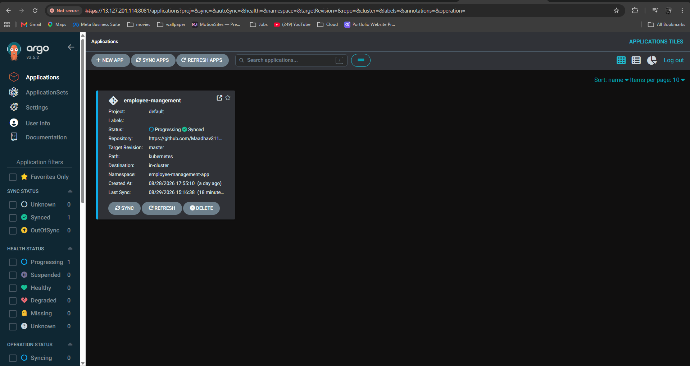

*Argo CD — sync status and health*

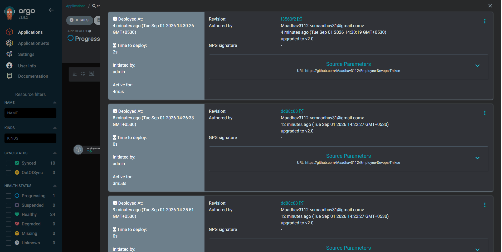

*Upgrade to v2.0 detected and synced*

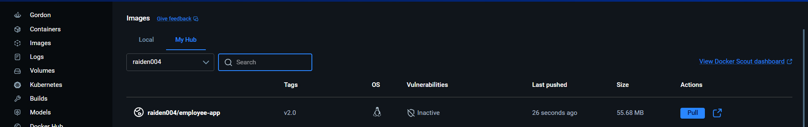

*Git history showing the v2.0 upgrade commit*

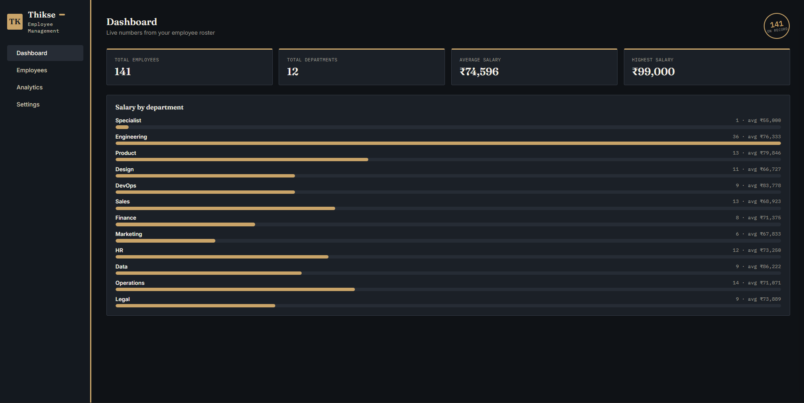

*Argo CD application detail after v2.0 deployment*

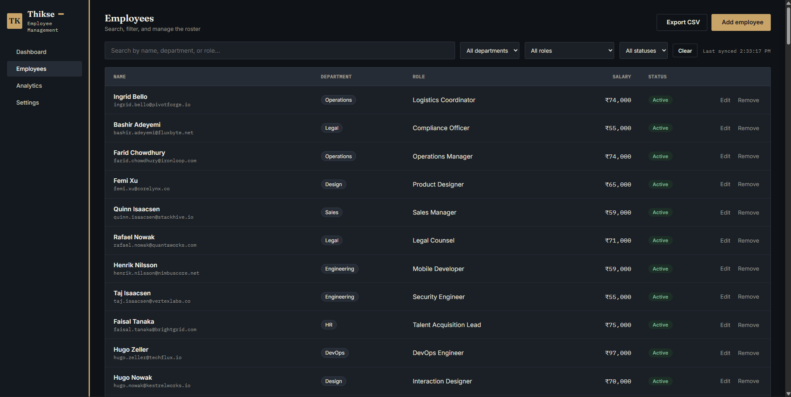

*Resource health and sync status for v2.0*

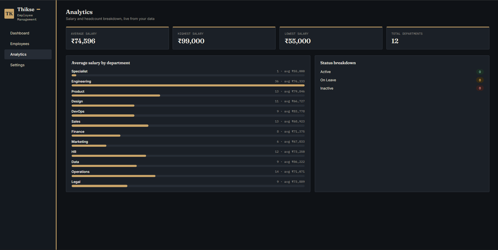

*Pod and container status under the v2.0 revision*

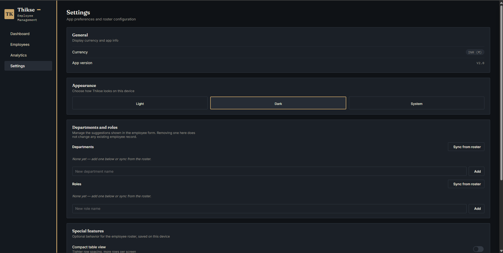

*Final confirmation of healthy v2.0 deployment*

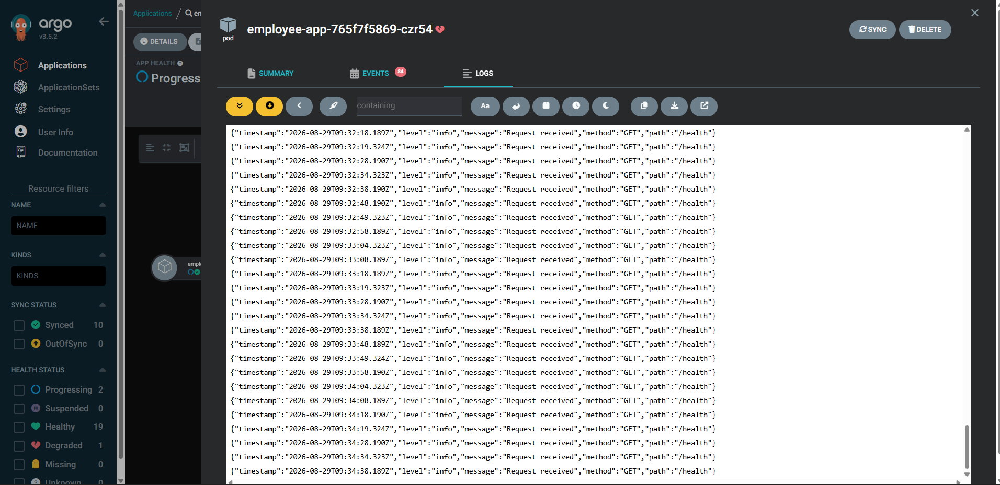

*Structured health-check logs (`GET /health`)*

**Version flow:** v1.0 (stable) → v2.0 (upgrade) → rollback via Git revision or Argo CD history.

---

## Kubernetes (EKS)

- Namespace isolation  
- Deployment with **≥ 2 replicas**  
- Service, ConfigMap, Secret  
- Liveness & Readiness probes  
- Resource requests/limits  
- Persistent storage for MongoDB where required  

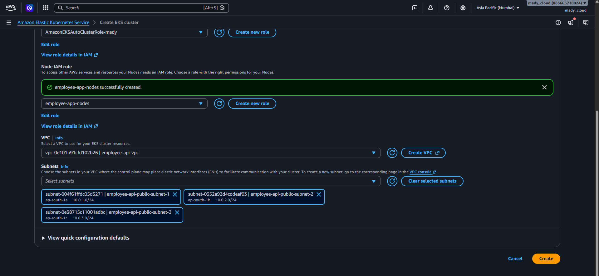

*EKS nodes registered and Ready*

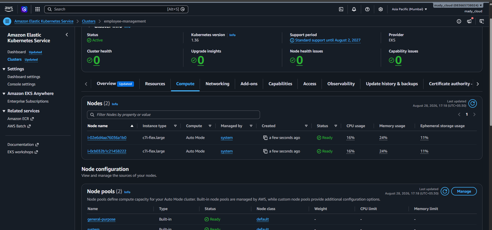

*Multiple application replicas healthy*

**Self-healing verified:**

- Delete pod → Deployment recreates it  
- Container crash → restart + probes recover  
- Readiness failure → pod removed from Service endpoints  

---

## Infrastructure as Code (Terraform)

Version-controlled, repeatable infrastructure (IAM roles/users, EKS-related resources, environment separation concepts).

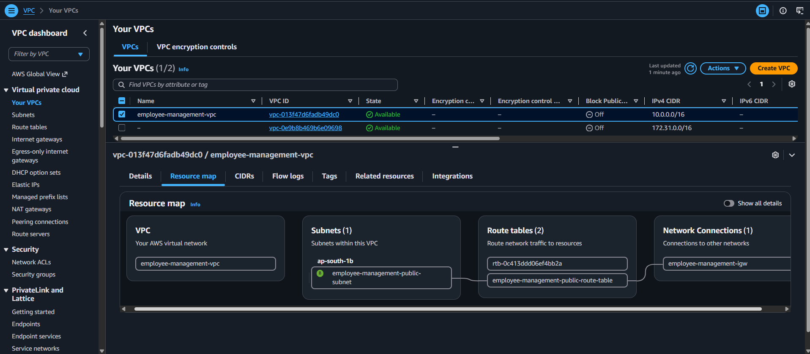

*terraform plan — preview of changes*

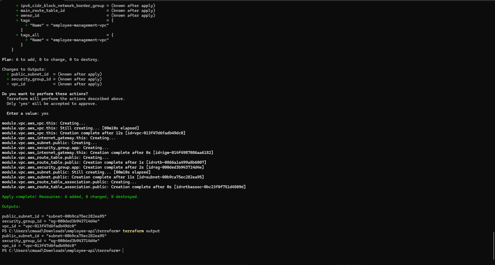

*terraform apply completed*

---

## Monitoring (Datadog)

**Deploy → Observe → Detect → Investigate**

Datadog Agent installed via **Datadog Operator** + `DatadogAgent` CR (`monitoring/datadog/datadog-agent.yaml`).

Setup summary:

1. `kubectl config set-context --current --namespace=datadog-agent`
2. Create secret (`api-key` + `app-key`)
3. Apply `DatadogAgent` manifest (APM + log collection)
4. Verify pods / DaemonSet
5. Confirm metrics & logs in Datadog UI

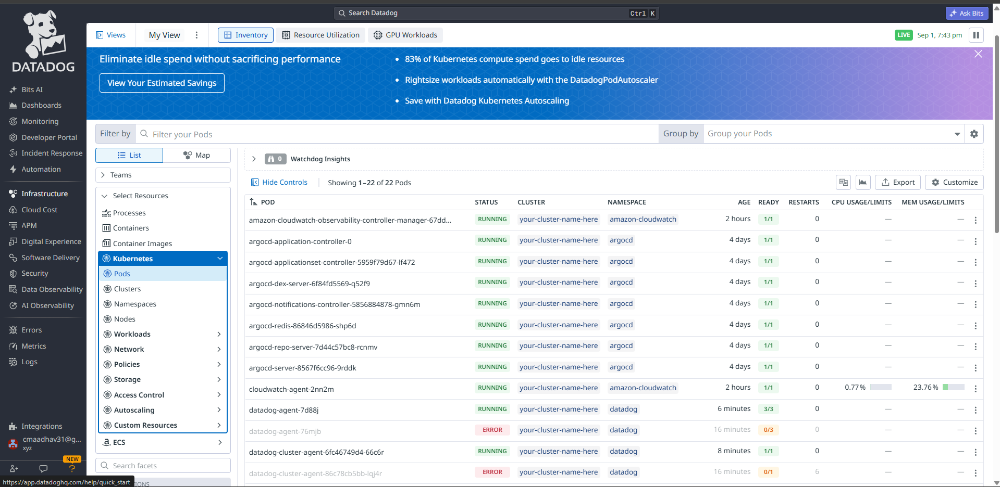

*Infrastructure — pods, status, CPU/memory*

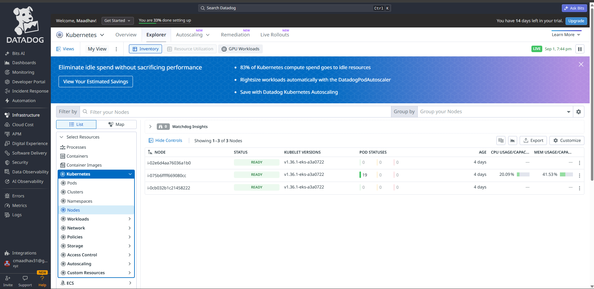

*Resource utilization dashboard*

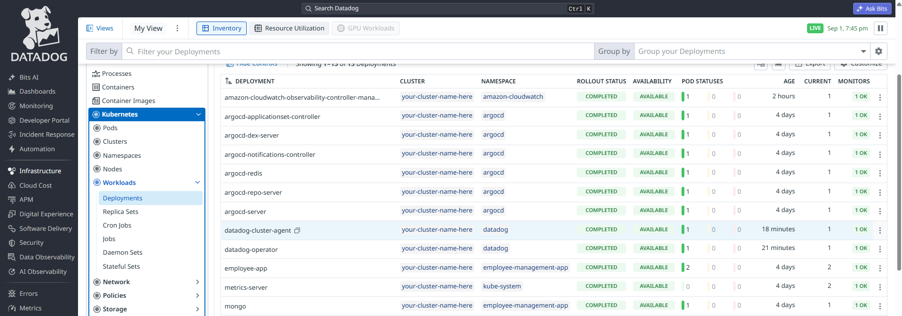

*CPU usage panels*

Signals monitored: CPU, memory, restart counts, readiness, structured logs.

---

## Security

| Control | Implementation |
|---------|----------------|
| Non-root containers | Dockerfile `USER` |
| Secrets vs config | Kubernetes Secret vs ConfigMap |
| No secrets in images | Injected at runtime |
| CI scans | Dependency + image + secret detection |
| Least-privilege IAM | Dedicated node role + Terraform admin role |

See `docs/security/` for full details.

---

## Rollback

```bash
# Via helper script
./scripts/rollback.sh v1.0

# Or Argo CD
argocd app history <app-name>
argocd app rollback <app-name> <history-id>
```

Demonstrated path: deploy v1 → deploy v2 → rollback to v1.

---

## Challenges & Solutions

| Problem | Solution |
|---------|----------|
| **EKS nodes not joining** | Missing IAM policies on node role → attached `AmazonEKSWorkerNodePolicy`, `AmazonEC2ContainerRegistryReadOnly`, `AmazonEKS_CNI_Policy` |
| **Terraform apply failures** | Insufficient IAM → dedicated `Terraform.admin` role + iterative plan/apply |
| **Argo CD OutOfSync / flapping** | Image tag mismatch + probe timeouts → aligned tags, tuned probes, hard refresh |
| **Datadog pods not visible** | Missing RBAC / agent config → fixed ClusterRole, verified API key, waited for scrape |

Full write-ups: `docs/troubleshooting/`

---

## Documentation

| Path | Content |
|------|---------|
| `docs/architecture/` | Application, container, K8s, CI/CD, cloud design |
| `docs/security/` | Security architecture, secrets, scanning |
| `docs/troubleshooting/` | EKS IAM, Terraform, Argo CD, Datadog, failures |
| `docs/deployment/` | Compose, K8s deploy, rollback, env config |
| `monitoring/` | Datadog setup steps, probes, alerts, logs |

---

## Getting Started

### Prerequisites

- Docker & Docker Compose  
- Node.js 18+ (for local non-Docker runs)  
- `kubectl` + access to an EKS cluster (for K8s)  
- Terraform (for IaC)  
- Datadog account (for monitoring)  

### Quick start (local)

```bash
git clone https://github.com/Maadhav3112/Employee-Devops-Thikse.git
cd Employee-Devops-Thikse
cp .env.example .env
docker compose up --build
```

Open http://localhost:9500

### Useful scripts

```bash
./scripts/build.sh v1.0
./scripts/test.sh
./scripts/health-check.sh http://localhost:9500
./scripts/deploy.sh
./scripts/rollback.sh v1.0
```

---

## Author

**Madhav** — Advanced DevOps Technical Assignment  

**Access boundary:** Controlled personal/internship resources only. No production credentials or internal product source code were used.
